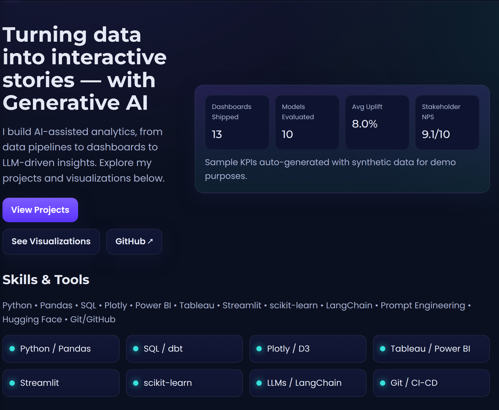
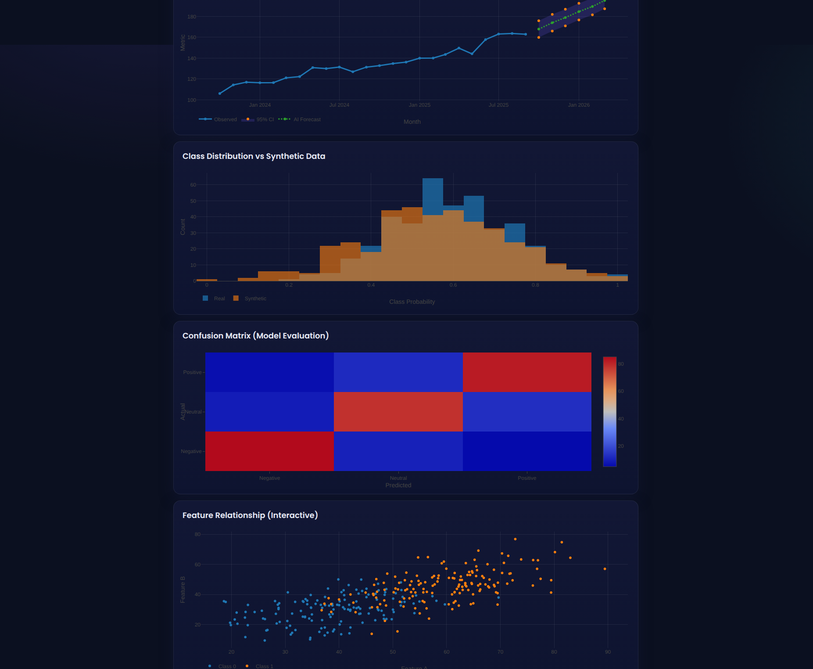

# Generative-AI-Data

Using generative AI Data to solve problems.

## Live Demos

- [Retail Review Sentiment](retail_sentiment_demo.html): sentiment & topics with
  GPT summaries.
- [Synthetic Fraud Detection](fraud_demo.html): tweak fraud rates and visualize transactions.
- [Churn Prediction Dashboard](churn_demo.html): explore churn risk with feature insights, SHAP-style visuals, and what-if analysis.

   
  <em>Figure 1: Design Creation</em>

   
  <em>Figure 2: Chart Evaluation</em>

Turning data into interactive stories — with Generative AI
I build AI-assisted analytics, from data pipelines to dashboards to LLM-driven insights. Explore my projects and visualizations below.

Generative AI Data Analyst

Turning data into interactive stories with Generative AI.
This portfolio showcases AI-assisted analytics — from data pipelines to dashboards to LLM-driven insights.

🚀 Explore projects, visualizations, and case studies designed to bridge data science, business insights, and generative AI.

📊 Skills & Tools

Programming & Data: Python, Pandas, SQL, scikit-learn

Visualization: Plotly, D3, Tableau, Power BI, Streamlit

Generative AI & LLMs: LangChain, Prompt Engineering, Hugging Face

DevOps & Workflow: Git, CI/CD

📈 Sample KPIs (Demo)

Dashboards Shipped: 13

Models Evaluated: 10

Avg Uplift: 8.0%

Stakeholder NPS: 9.1/10

(Synthetic data used for demo purposes)

📂 Projects
1. AI-Driven Review Sentiment (Retail)

LLM-assisted sentiment + topic modeling with Plotly dashboards and GPT-generated summaries.

🛠 Tools: Python, LLM, Plotly, NLP

🔗 GitHub Repo
