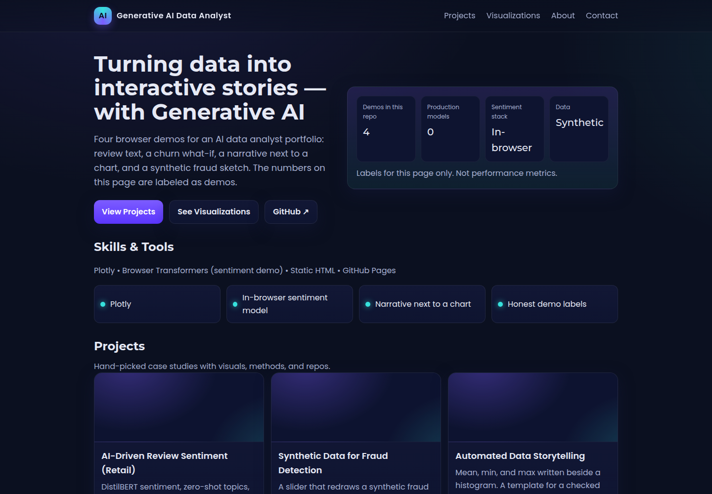
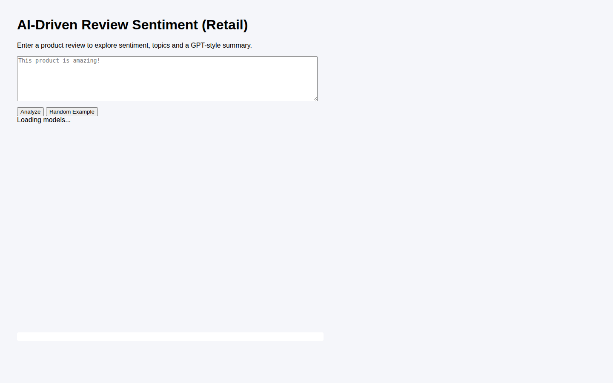
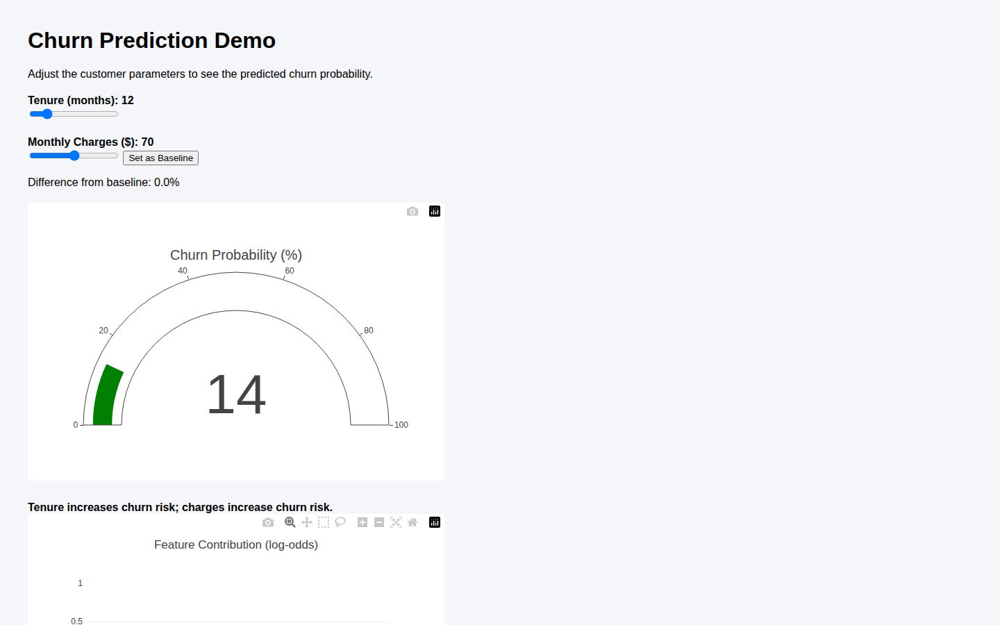
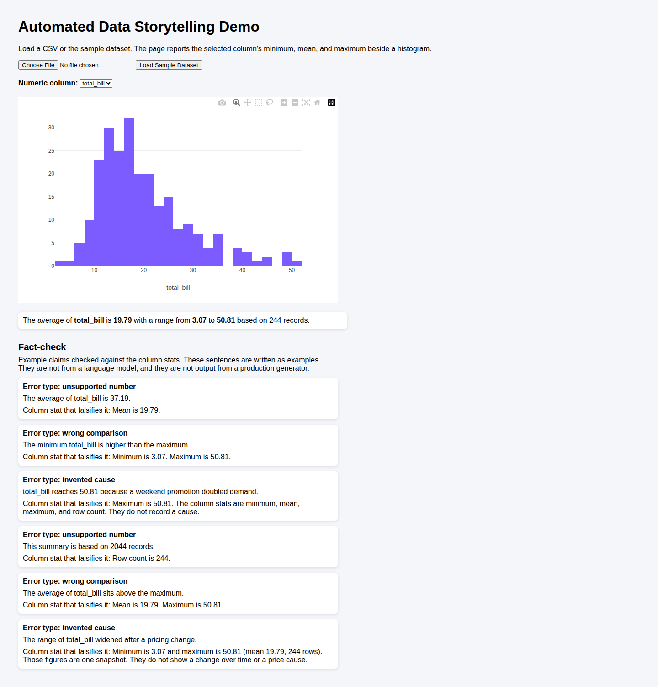

# Generative AI Data Portfolio

## For an AI data analyst application

**Show this after the stroke casebook, not instead of it.** The sentiment page runs DistilBERT in the browser. The churn page is a two-feature logistic sketch. The story page writes minimum, mean, and maximum next to a histogram, then checks example claims against those stats. The fraud page draws a synthetic cloud. Say that out loud. Do not claim LangChain, Power BI, Tableau, dbt, or a production uplift.

Four browser demos. The data is synthetic or illustrative. Sentiment runs DistilBERT in the browser. Churn is a two-feature logistic sketch. Storytelling prints a column's minimum, mean, and maximum beside a histogram, then checks example claims against those stats. Fraud draws a synthetic cloud.

## Portfolio

| Project | Business question | Demonstration |
|---|---|---|
| Retail sentiment | What are customers saying, and which themes matter most? | [Open demo](https://parbproject.github.io/Generative-AI-Data/retail_sentiment_demo.html) |
| Fraud exploration | How does fraud prevalence change transaction patterns? | [Open demo](https://parbproject.github.io/Generative-AI-Data/fraud_demo.html) |
| Churn analysis | Which factors appear to increase customer churn risk? | [Open demo](https://parbproject.github.io/Generative-AI-Data/churn_demo.html) |
| Automated storytelling | What do the column minimum, mean, and maximum actually support? | [Open demo](https://parbproject.github.io/Generative-AI-Data/automated_data_storytelling_demo.html) |

## Skills Demonstrated

- Four demos on synthetic or illustrative data
- In-browser DistilBERT sentiment
- Storytelling as column minimum, mean, and maximum, with example claims checked against those stats
- Churn as a two-feature logistic sketch
- Fraud as a synthetic point cloud
- Static HTML on GitHub Pages

## Repository Structure

~~~text
.
├── index.html
├── retail_sentiment_demo.html
├── fraud_demo.html
├── churn_demo.html
├── automated_data_storytelling_demo.html
└── images/
~~~

## Run Locally

Clone the repository and open "index.html" in a browser. No build process or package installation is required.

## Data Note

The examples are portfolio demonstrations and use synthetic or illustrative data. Any displayed performance figures should be interpreted as demo outputs rather than production results.
