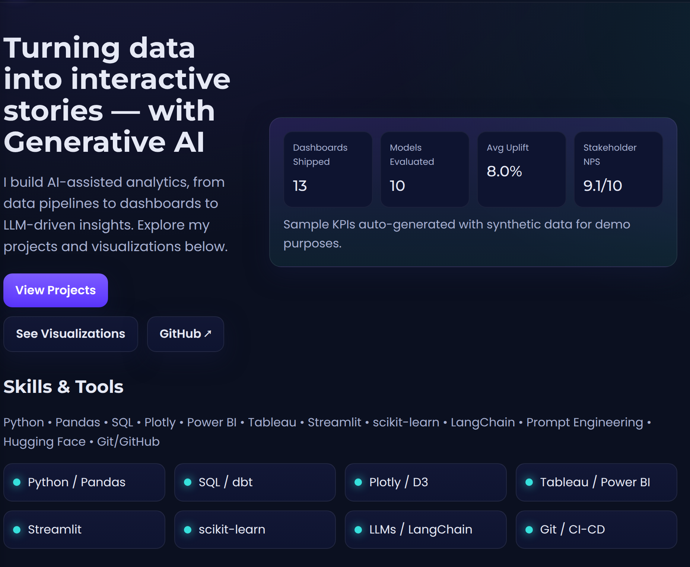
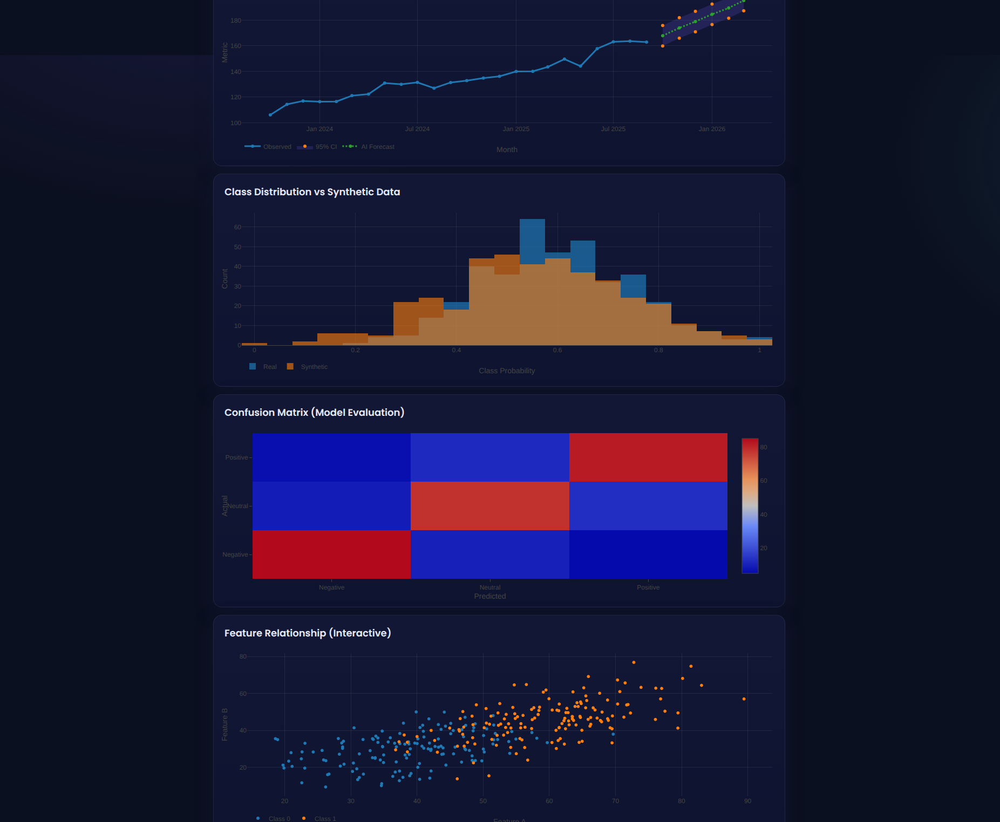

# Generative AI Data Portfolio

## For an AI data analyst application

**Show this after the stroke casebook, not instead of it.** The sentiment page actually runs a transformer in the browser. The churn page is a two-coefficient sketch. The story page writes min, mean, and max next to a histogram. Say that out loud. Do not claim LangChain, Power BI, Tableau, or a production uplift.

A collection of browser-based analytics demonstrations that turn data into clear, interactive stories. The portfolio explores practical uses of generative AI across customer feedback, fraud analysis, churn risk, and automated narrative reporting.

## Portfolio

| Project | Business question | Demonstration |
|---|---|---|
| Retail sentiment | What are customers saying, and which themes matter most? | [Open demo](https://parbproject.github.io/Generative-AI-Data/retail_sentiment_demo.html) |
| Fraud exploration | How does fraud prevalence change transaction patterns? | [Open demo](https://parbproject.github.io/Generative-AI-Data/fraud_demo.html) |
| Churn analysis | Which factors appear to increase customer churn risk? | [Open demo](https://parbproject.github.io/Generative-AI-Data/churn_demo.html) |
| Automated storytelling | How can analysis be translated into a concise narrative? | [Open demo](https://parbproject.github.io/Generative-AI-Data/automated_data_storytelling_demo.html) |

## Preview

  

  

## Skills Demonstrated

- Translating business questions into focused analytics experiences
- Data storytelling, dashboard design, and visual hierarchy
- Generative-AI-assisted summaries and explanatory content
- Sentiment, fraud, and churn use-case design
- Static web deployment with GitHub Pages

## Repository Structure

~~~text
.
├── index.html
├── retail_sentiment_demo.html
├── fraud_demo.html
├── churn_demo.html
├── automated_data_storytelling_demo.html
└── images/
~~~

## Run Locally

Clone the repository and open "index.html" in a browser. No build process or package installation is required.

## Data Note

The examples are portfolio demonstrations and use synthetic or illustrative data. Any displayed performance figures should be interpreted as demo outputs rather than production results.
